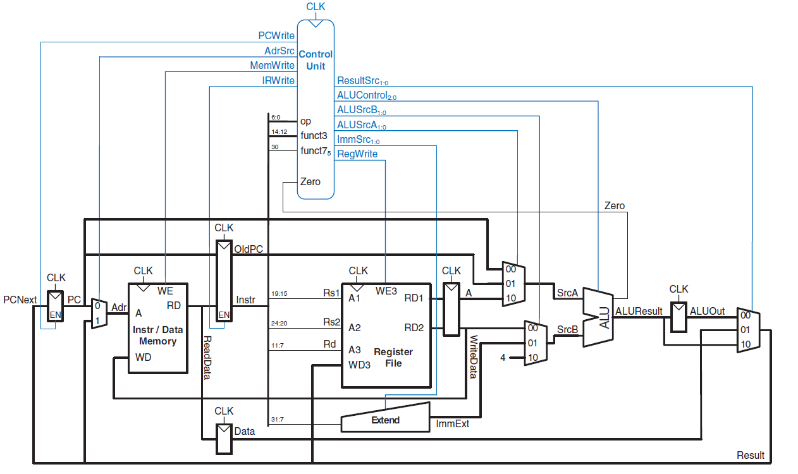
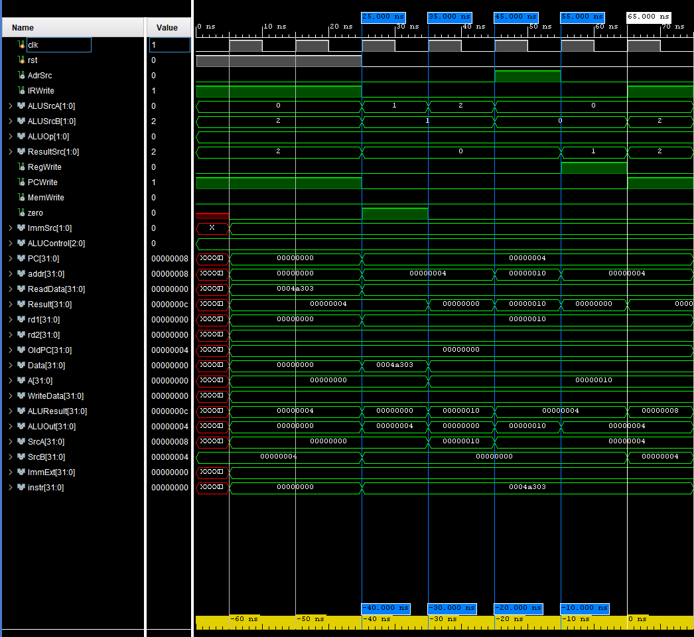

# Multicycle RISC-V (RV32I) Core in Verilog

A functional 32-bit Multicycle RISC-V processor core designed in Verilog HDL, based on the architecture described in *Digital Design and Computer Architecture: RISC-V Edition* by Sarah L. Harris & David Harris. 

The core incorporates a unified Instruction & Data Memory, non-architectural stage registers to balance path delays across cycles, and an algorithmic Finite State Machine (FSM) control unit.

---

## 🚀 Key Features & Specifications(version: v1.1)

- **Architecture:** Multicycle RV32I Base Integer Instruction Set (subset).
- **Memory Architecture:** Unified Instruction and Data memory with a single read/write port (Von Neumann interface).
- **Clock Cycles per Instruction (CPI):**
  - **Memory Load (`lw`):** 5 cycles (Fetch $\to$ Decode $\to$ MemAddr $\to$ MemRead $\to$ MemWriteback)
  - **Memory Store (`sw`):** 4 cycles (Fetch $\to$ Decode $\to$ MemAddr $\to$ MemWrite)
  - **R-Type (`add`, `sub`, etc.):** 4 cycles (Fetch $\to$ Decode $\to$ Execute $\to$ ALUWriteback)
  - **Branch (`beq`):** 3 cycles (Fetch $\to$ Decode $\to$ Branch)
- **EDA & Simulation Environment:** AMD Vivado (Behavioral Simulation).
- **Target Language:** Synthesizable Verilog HDL (IEEE 1364-2001).

---

## 🏛️ Datapath & Architecture Overview

  
*Figure 1: Multicycle Datapath and Control Unit (Source: Harris & Harris).*

The multicycle design optimizes hardware resource utilization by sharing functional blocks (such as the ALU and Memory) across multiple clock cycles:

1. **Instruction Fetch (`S_FETCH`):** Fetches instruction from memory at address `PC`, latches it into the Instruction Register (`IR`), and computes `PC + 4`.
2. **Instruction Decode / Register Read (`S_DECODE`):** Reads register operands `A` and `B` from the Register File, decodes opcode/funct fields, and pre-calculates the branch target (`PC + Imm`).
3. **Execution / Address Calculation:** Routes operands to the unified ALU for effective address calculation or arithmetic operations.
4. **Memory Access / Writeback:** Handles data memory read/write operations or commits ALU/Memory results back to the Register File (`RegWrite`).

---

## 📁 Repository Structure
```text
├── src/
|  |───sim1/new
│     ├── top.v                    # Top-level integration (Datapath + Control Unit)
│     ├── control_unit.v           # Main FSM + ALU decoder wrapper
│     ├── main_FSM.v               # Multicycle controller state machine
│     ├── instr_decoder.v          # Opcode & immediate generator logic
│     ├── register_file.v          # 32x32-bit register file (with x0 hardwired to 0)
│     ├── program_counter.v        # PC register with enable and reset controls
│     └── instraAndDataMemory.v    # Unified instruction/data synchronous RAM block
|  |───sources_1/new
|     |─── control_unit.v
|     |─── tb.v                    # testbench
├── docs/
│   ├── datapath.png             # Architecture diagram
│   └── waveforms/
│       └── simulation.png       # Waveform traces & verification snapshots
└── README.md
```

## 🧪 Verification & Instruction Testing
To ensure the design functions properly, targeted instructions are embedded into the instraAndDataMemory.v unified memory module for behavioral simulation verification:

Preloaded Instruction Sequences in RAM:
verilog:
```text
initial begin
// lw instruction example for behavioral simulation verification (5 cycles)
// RAM[0] = 32'h0004A303; // lw x6, 0(x9)

// sw instruction example for behavioral simulation verification (4 cycles)
// RAM[0] = 32'h0064A023; // sw x6, 0(x9)

// R-type instruction example for behavioral simulation verification (4 cycles)
// RAM[0] = 32'h009303B3; // add x7, x6, x9

// beq instruction example for behavioral simulation verification (3 cycles)
// RAM[0] = 32'h00630463; // beq x6, x6, 8
end

```
Simulation Results(only lw instuction is shown in readme file the rest are in docs\waveform folder):

*Figure 2: shows lw instuction waveforms in behavioral simulation.*

## 📖 References
Harris, S. L., & Harris, D. Digital Design and Computer Architecture: RISC-V Edition. Morgan Kaufmann.
The RISC-V Instruction Set Manual, Volume I: User-Level ISA.
